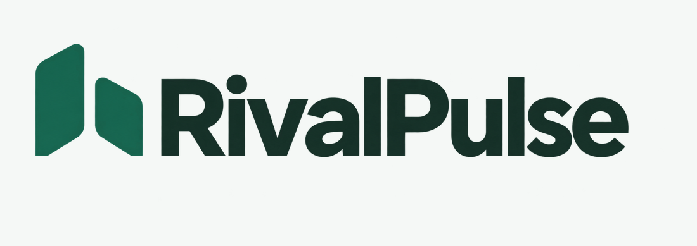

<div align="center">



### Know what changed. See the evidence. Decide what matters.

Evidence-backed competitor intelligence for Indonesian public companies.<br />
Built for marketing and strategy teams—not trading decisions.

[](https://github.com/RomoRusdi/RivalPulse/actions/workflows/ci.yml)


[Quick start](#quick-start) · [How it works](#how-it-works) · [Documentation](#documentation) · [Limitations](#important-limits)

</div>

---

## More than a feed of headlines

Ask a question in **English or Bahasa Indonesia**. RivalPulse brings together competitor news, company financials, and saved evidence—then separates **what was observed** from **what AI thinks it might mean**.

> **What happened → Why it matters → Possible implication → Suggested next step**
>
> Evidence stays inspectable. Uncertainty stays visible. Suggested actions never execute automatically.

## What you can do

| Capability | What you get |
| --- | --- |
| **Track your competitive landscape** | A watchlist of 2–5 competitors, with an independent optional own-company perspective. |
| **Investigate with evidence** | Sectors v2 reports and news, approved public pages, progress updates, cancellation, and explicit coverage gaps. |
| **Understand the context** | Financial updates, analyst commentary, and company mentions kept separate from competitor moves. |
| **Pick your AI** | Local Ollama, OpenAI, Anthropic, or Gemini through owner-managed workspace settings. |
| **Keep your research** | Accounts, conversations, findings, and immutable evidence saved in PostgreSQL. Workspace provider keys are encrypted server-side. |
| **Share the result** | Excel-compatible `.xls` investigations and text finding briefs, retaining figures, interpretations, and notes/limitations. |

## Quick start

**For Windows:** Docker Desktop with Linux containers and **Node.js 20.9+**. Live research needs a Sectors API key. For AI, choose either Ollama with an installed model or a supported cloud provider with your API key. Python 3.11+ is only needed for local backend development/tests.

**1. Create your local configuration**—without overwriting existing files:

```powershell
if (-not (Test-Path backend/.env)) { Copy-Item backend/.env.example backend/.env }
if (-not (Test-Path frontend/.env.local)) { Copy-Item frontend/.env.example frontend/.env.local }
```

**2. Configure verification SMTP** in `backend/.env` for ordinary signup. Optionally add a shared `SECTORS_API_KEY`, or connect your workspace key in Settings after login.

**3. Start the app:**

```powershell
.\START_SECTORS.ps1
```

Open **http://localhost:8080**, sign up and verify your email—or log in to an existing account. Visit **Settings** to configure your data connection and AI model.

Saving keys/settings does **not** run a paid connection test. The AI **Connect** button lists provider models without generating an answer.

To stop the Docker stack while keeping database and Redis volumes:

```powershell
.\STOP_SECTORS.ps1
```

→ [Full setup guide](docs/SETUP.md): SMTP, administrator accounts, manual startup, and troubleshooting.

## Start with a question

| Try asking | What happens |
| --- | --- |
| “Show my competitor watchlist.” | An instant workspace command; no research. |
| “Summarize the stored findings for TLKM.” | Saved evidence only; no new collection or AI generation. |
| “Compare annual revenue and earnings for TLKM and EXCL.” | A new cited investigation; provider charges may apply. |
| “Research recent product and partnership activity for ISAT.” | Bounded news research, not an exhaustive search. |

Use companies in your current watchlist; add or change them under **Competitors**.

## How it works

```text
Your question → FastAPI → Bounded research worker
                                  │
                       Sectors + approved pages
                                  │
                       Validated AI interpretation
                                  │
                       Saved evidence and results
```

**The backend is in charge.** It owns access, budgets, approved tools, source figures, arithmetic, and citation checks. The selected model supplies bounded qualitative interpretation; it cannot execute arbitrary tools or write financial facts.

Opening saved results and exporting them does not collect data or regenerate analysis. Sectors is the **only live financial provider**; changing AI models does not change that.

## Documentation

| Guide | Start here when… |
| --- | --- |
| [Setup & operations](docs/SETUP.md) | You want to run the app or update another installation safely. |
| [Architecture & evidence](docs/ARCHITECTURE.md) | You want to understand the agent, credentials, billing, and accuracy caveats. |
| [Development & handoff](docs/DEVELOPMENT.md) | You want to test, maintain, or publish the project. |
| [Sectors endpoint reference](docs/SECTORS_ENDPOINT_REVIEW.md) | You need source coverage, endpoint costs, and metadata constraints. |

### Repository at a glance

```text
RivalPulse/
├── frontend/     Next.js interface, response contracts, and exports
├── backend/      FastAPI, research agent, providers, migrations, and tests
├── docs/         Setup, architecture, development, and source reference
└── scripts/      Repository checks and offline startup tests
```

<details>
<summary><strong>Development checks</strong></summary>

From the repository root:

```powershell
cd backend
python -m venv .venv
.venv/Scripts/python.exe -m pip install -e ".[test]"
.venv/Scripts/python.exe -m pytest -q -m "not integration"
.venv/Scripts/ruff.exe check app tests scripts migrations

cd ../frontend
npm ci
npm test
npm run lint
npm run build
```

GitHub Actions runs offline tests, lint, and the frontend build. See [Development](docs/DEVELOPMENT.md) for repository/startup checks and API contracts.

</details>

## Important limits

- **Separate costs:** Sectors requests and cloud-model use may incur separate charges. Internal research credits are application limits, not an authoritative provider balance.
- **Evidence is bounded:** Missing/unreviewed evidence does not prove nothing changed. AI attribution and implications require human review.
- **Financial assumptions need review:** Some Sectors monetary fields lack currency, scale, or reporting-scope metadata. The current display/export includes a rupiah inference for large unlabeled figures; it is **not source-confirmed currency**.
- **Excel compatibility:** `.xls` exports are HTML-based tables, not native `.xlsx` workbooks. Excel may show a format warning.
- **Local development, not public production:** The included Compose/gateway setup is not a hardened public deployment. Keep secrets out of Git and retain the encryption master key with protected database backups.

--- 

<div align="center">

**RivalPulse** · Evidence first. Interpretation second.

<sub>Information and analysis only. Not investment advice.</sub>

</div>
