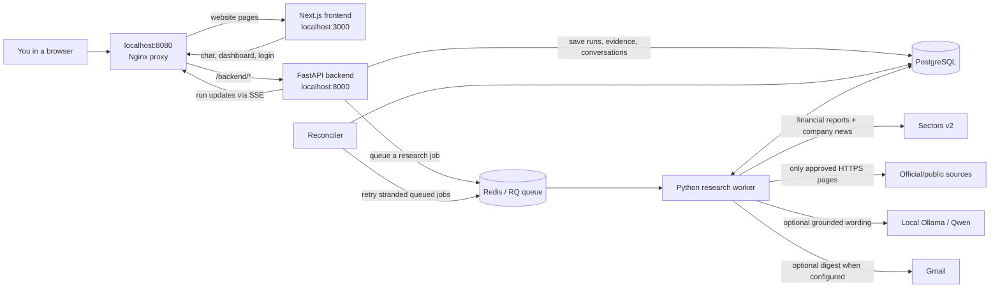
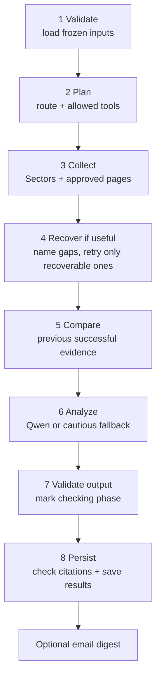

# RivalPulse: a beginner's map of the project

This guide describes the **current local project**. You do not need to know every file before you can understand the main idea. Start with the pictures, then follow one example request through the files.

> **In one sentence:** RivalPulse lets you watch a small group of Indonesian public companies, asks approved sources and Sectors for evidence, and produces cited competitor findings and cautious AI explanations.
>
> **Not investment advice.** The product is aimed at marketing/strategy questions, not trading.

## 1. Five words to learn first

| Word | Plain-English meaning in this project |
| --- | --- |
| **Frontend** | The website you see and click (Next.js/React, in `frontend/`). |
| **Backend / API** | The Python server that receives requests, checks permission and decides what can happen (FastAPI, in `backend/`). |
| **Worker / queue** | A separate process that does slow research after the API says “request accepted.” Redis holds the to-do list; RQ workers take jobs from it. |
| **Snapshot / evidence** | A saved copy of a provider answer or approved webpage, plus a pointer to the exact fact used. It lets you check *where an answer came from*. |
| **Orchestration** | The code-controlled order of decisions and actions: choose a route, plan tools, collect evidence, recover gaps, compare, interpret, validate and save. The language model does **not** control the whole app. |

Think of a restaurant: the frontend is the counter, the API takes and checks the order, Redis is the order queue, the worker is the kitchen, PostgreSQL is the durable recipe/order history, Sectors and official sites are ingredient suppliers, and Ollama/Qwen helps write the explanation. The kitchen must check the ingredients before serving.

## 2. Big-picture diagram



**Important:** `START_SECTORS.ps1` starts the frontend in a separate PowerShell window, and Docker Compose starts the other services. `STOP_SECTORS.ps1` stops the **Docker stack** while keeping its database volumes; close the separate frontend window or press Ctrl+C there to stop the Next.js dev server. Docker Desktop and Ollama are separate applications.

## 3. What is in each top-level folder?

| Location | What it is | Read it when... |
| --- | --- | --- |
| `frontend/` | Next.js website: pages, chat, buttons, API calls, browser state. | You want to change what users see or how they interact. |
| `backend/` | FastAPI server, research worker, Sectors integration, database and tests. **This is the production research engine.** | You want to change evidence collection, safety rules or the agent workflow. |
| `rivalpulse_agent/` | An earlier **standalone agent laboratory** and its own tests. Its ideas influenced the backend, but it is **not** the worker that the website calls. | You want to study an independent prototype; don't mistake it for the live app. |
| `docs/` | Diagrams and guides, including this one and `agent-workflow.svg`. | You want an overview before reading code. |
| `START_SECTORS.ps1` / `STOP_SECTORS.ps1` | Windows convenience scripts. | You want to start or stop the local Sectors stack. |
| `README.md` | High-level project introduction. | You have just opened the repository. |
| `RivalPulse_Agent_Workflow.pdf` | Existing, more technical workflow picture. | You want another visualization after this guide. |

### `frontend/`: important files

| File/folder | Job |
| --- | --- |
| `src/app/` | URL routes. A `page.tsx` file usually becomes a page. The `(app)` and `(auth)` parentheses are **route groups**, not literal URL text. |
| `src/app/(auth)/login/page.tsx`, `src/components/auth/LoginForm.tsx` | Demo sign-in screen and token submission. |
| `src/components/auth/DemoSessionGate.tsx` | Checks the server session before showing the private workspace. |
| `src/app/(app)/layout.tsx` | Wraps app pages with the session check, shared store, sidebar/shell and toasts. |
| `src/app/(app)/page.tsx` | The `/` home page; mounts `AgentWorkspace`. |
| `src/components/agent/AgentWorkspace.tsx` | Chat window: receives your message, chooses instant action or research, shows progress, history and citations. |
| `src/lib/agent-router.ts` | Simple rule-based router for commands such as “add BBCA” and “show my watchlist.” No research provider call for these. |
| `src/lib/store.tsx` | Shared React state: active run, watchlist, signals, dashboard and actions. |
| `src/lib/api.ts` | Frontend network boundary: sends login, watchlist and run requests; listens to live progress using SSE. Can use mock data instead of the backend. |
| `src/lib/schemas.ts` and `src/lib/types.ts` | Zod checks actual JSON received from the API; TypeScript types are derived from those checks. This is the **frontend** side of the API contract. |
| `src/lib/chat-history.ts`, `src/lib/persistence.ts` | Chat-session parsing/local copy and other browser-local state. Chat conversations also sync to the backend when connected. |
| `src/lib/catalogue.ts`, `src/lib/mock-data.ts` | UI company choices and **fake demo data**. Mock data is not live Sectors data. |
| `src/app/(app)/signals/page.tsx` | The main “What changed” page, combining summaries and signal list. |
| `src/app/(app)/signals/[id]/page.tsx`, `src/components/signal/` | One finding's detail, evidence and financial context. `[id]` means the URL contains a signal ID. |
| `src/app/(app)/overview/page.tsx`, `summary/page.tsx`, `timeline/page.tsx` | Old URLs now redirect to `/signals`. |
| `src/app/(app)/actions/`, `alerts/`, `watchlists/`, `settings/` | Other workspace pages. `src/components/shell/Sidebar.tsx` links to them. |
| `src/app/globals.css`, `src/components/ui/` | Colours, spacing, basic UI building blocks. |
| `.env.local` | Your **ignored local** frontend settings. `NEXT_PUBLIC_*` values are visible to browser users: never put the Sectors key or private token there. |

### `backend/`: important files

| File/folder | Job |
| --- | --- |
| `compose.yaml`, `Dockerfile`, `nginx.conf` | Create/run services and proxy browser traffic to frontend or API. |
| `app/config.py` | Reads server settings and safe limits. `backend/.env` (ignored by Git) supplies secrets locally. |
| `app/main.py` | FastAPI routes, login, workspace checks, watchlists, runs, run-progress stream, signals and dashboard. This is the HTTP entry point. |
| `app/contracts.py` | Pydantic request/response validation on the **backend** side of the API contract. |
| `app/service.py` | Business rules for watchlists and run creation; freezes which companies and pages a run may inspect. |
| `app/jobs.py` | Enqueues jobs into Redis, runs the RQ worker, and reconciles jobs left behind after failures. |
| `app/research.py` | The **durable research pipeline**: its eight stages, comparison, evidence validation, publication and recovery. Start here for orchestration. |
| `app/agent.py` | Chooses the route and bounded tool plan, optionally calls local Qwen, checks its output, and implements the approved tool interface. |
| `app/providers.py` | Sectors v2 HTTP calls, cache, normalization, financial arithmetic and local credit reservations; Sectors company news is normalized here too. |
| `app/public_sources.py`, `app/classify.py` | Safely fetch/extract approved pages and classify real announcements. No arbitrary-web browsing. |
| `app/models.py`, `app/db.py` | Database tables and SQLAlchemy connection/session helpers. |
| `app/compat.py` | Converts detailed backend runs/signals to the JSON shape expected by the current frontend. It exposes real tool calls and agent decisions. |
| `app/seed.py`, `app/sources.py`, `sources.example.json` | Initial company/watchlist data and admin-managed approved public-source configuration. A catalogue entry is **not** permission to scrape that company's website. |
| `app/alerts.py` | Optional digest for newly published important findings, if Gmail is configured. |
| `migrations/` | Alembic scripts that create/update database tables and history protections. |
| `tests/`, `app/fixtures/` | Automated tests and synthetic replay fixtures. They are **not** the live financial provider. |
| `docs/openapi.json`, `docs/examples.json` | Generated API description and example responses. |
| `.env.example` | Safe template; copy to **ignored** `.env`, then fill secrets there. Never commit the real `.env`. |

## 4. Two kinds of chat message

### A. Instant workspace command (cheap)

Example: **“Add BBCA to my watchlist.”**

```text
AgentWorkspace.tsx
   -> agent-router.ts recognizes a simple command
   -> store.tsx updates the watchlist
   -> api.ts PATCH /watchlist
   -> main.py checks login and calls service.py rules
   -> PostgreSQL saves watchlist membership
   -> chat displays the result
```

No research run, no Qwen decision and no Sectors research request are needed. The **backend** still validates the company and 2–5-company rule. The chat text is rule-matched, not magic: ambiguous instructions may ask for clarification.

### B. Investigation (potentially costs credits)

Example: **“What competitor product or partnership announcements should we pay attention to?”**

```text
AgentWorkspace.tsx -> store.tsx -> api.ts POST /runs
    -> main.py -> service.py creates a queued Run in PostgreSQL
    -> jobs.py puts the Run ID in Redis
    -> worker calls research.py:execute_run(run_id)
    -> agent.py chooses allowed tools; providers.py / public_sources.py gather evidence
    -> research.py compares, checks and stores the answer
    -> main.py GET /runs/{id}/stream sends status via SSE
    -> compat.py converts backend data to frontend JSON
    -> api.ts validates it with schemas.ts
    -> store.tsx / AgentWorkspace.tsx display the result
```

**SSE** means *server-sent events*: the browser keeps a connection open and receives an updated status message roughly every two seconds. The slow research does not need to happen inside the initial HTTP request. The detailed backend status can be `completed`, `partial` or `failed`; the compatibility response maps both `completed` and `partial` to the frontend's `complete` while preserving `coverageStatus` so limited evidence stays visible.

## 5. The research pipeline, stage by stage

This is the exact stage list in `backend/app/research.py`:



| Stage | File to inspect | What is happening? |
| --- | --- | --- |
| **Validate** | `research.py:execute_run`, `service.py:create_run` | The run already has frozen watchlist members, approved page settings, and a possible previous-run baseline. A worker claims the job with a lease so an old worker cannot write over a newer attempt. |
| **Plan** | `agent.py:Agent.plan`, `research.py:execute_run` | Simple keyword rules choose *annual financial statements only* or *competitive activity*. The plan must include necessary per-company tools and obey the company/request limits. Normal live planning is deterministic; Qwen planning is off unless explicitly enabled. |
| **Collect** | `agent.py:Tools`, `providers.py:Sectors`, `public_sources.py` | Run approved tools sequentially. Sectors supplies company financial reports and, for activity queries, company news. Approved company pages can add corroborating observations. Save returned snapshots and a coverage record. |
| **Recover** | `research.py:diagnose` / `recovery_plan` | Look at what actually arrived. If a remaining approved page can close a gap, read it within the same limits. If not, record why rather than requesting endlessly. This stage is recorded when gaps exist. |
| **Compare** | `research.py:candidates_for` / `financial_brief_for` | For activity: compare classified events to earlier successful evidence of the same source and mode; decide baseline/new/updated. For a statement-only question: assemble cited annual financial rows instead of pretending annual statements prove recent announcements. |
| **Analyze** | `agent.py:Agent.analyze` / `analyze_financial`, `research.py:score_candidate` | Code computes severity; optional local Qwen writes cautious marketing interpretations linked to known claim IDs. No invented numeric data is accepted. |
| **Validate output** | `research.py:execute_run`, `contracts.py` | Record that the run is entering output checks. This named stage does **not** itself perform all citation checks: the final card validation happens in the next function. |
| **Persist** | `research.py:persist` / `validate_card`, `models.py` | Check structure, actual source text, citations and financial JSON pointers; financial figures must cite **Sectors financial report** snapshots. Then commit the validated result and new signal revisions together. Identical findings remain unchanged; a first observation is a baseline. Optional alerts run after saving. |

A **tool** is one allowed action such as `get_company_metrics`, `get_company_news`, or `get_recent_signals`. A **stage** is a larger phase such as `collect`, which can execute several tools. The chat's “Tool calls” list comes from actual recorded coverage in `compat.py`; it is not just a list of stage names.

### How much power does Qwen have?

- Qwen runs locally through Ollama when `LLM_ENABLED=true`. This is separate from Sectors.
- In the normal live setup, `LLM_PLAN_ENABLED=false`: **Python chooses the tools**; Qwen can help *interpret* evidence.
- If model planning is enabled, Python still validates company IDs, tool names, company count, required tools and budgets. An invalid plan gets one repair attempt, then a recorded safe fallback. Model availability errors do not secretly change provider permissions.
- Code owns numbers, financial arithmetic, citations, permissions and database writes. Qwen is a **carefully checked writer**, not a free-roaming web-browsing agent.

## 6. A fact's journey: why citations matter

```text
Sectors annual report OR Sectors company news OR an approved public page
      -> normalized fact/event in a Snapshot (models.py)
      -> linked to this Run with RunSnapshot
      -> candidate in research.py (compared with earlier successful evidence)
      -> claim + Evidence pointing back to its Snapshot / URL / JSON pointer
      -> validated Signal card and immutable Revision
      -> compat.py projects it for the frontend
      -> /signals and /signals/[id] show the result
```

Example: a Sectors report provides `revenue = 123` for a stated year. `providers.py` stores it with the source's JSON pointer, currency and unit **if actually supplied**. `research.py` refuses to guess missing currency or calculate growth across unknown reporting bases. An activity finding might have an observed announcement, numeric financial context and an *explicitly uncertain* hypothesis. These are three different things; the hypothesis is **not** a fact.

**First observation ≠ new change.** The first good observation is a `baseline`; later identical evidence does not create a fresh alert. An unreachable site or missing financial report means limited evidence, **not** “nothing happened.”

## 7. Where the data lives

| Storage | Kept for what? | Important distinction |
| --- | --- | --- |
| **PostgreSQL** | Watchlists, conversations, runs and their steps, snapshots, signal revisions/citations, cache records, internal credit reservations. | Durable source of truth. Stopping Docker **without** deleting volumes keeps it. |
| **Redis** | RQ job queue and locks to avoid duplicate provider fetches. | If a queue delivery is lost, `jobs.py`'s reconciler can requeue eligible work. |
| **Browser localStorage** | Read/unread state, local profile, a local copy of chat history and mock-mode state. | The editable profile is **not** a server-side multi-user account. Deleting a chat conversation does **not** erase research evidence. |
| **Sectors' own account** | The provider's real billing and remaining credits. | `credit_accounts` in our database are **internal conservative reservations**, not proof of the actual Sectors balance. Check Sectors' dashboard for billing. |

## 8. Mock, replay and live: do not mix them up

1. **Frontend mocks** (`frontend/src/lib/mock-data.ts`) make the website look populated without a backend. Controlled by `NEXT_PUBLIC_USE_MOCKS`. They are not evidence.
2. **Backend replay** (`backend/app/fixtures/` and tests) is synthetic data for automated tests only. It cannot be selected by the live Docker Compose configuration.
3. **Live Sectors** is the only financial provider for real investigations. The backend key stays in ignored `backend/.env`; the browser never calls Sectors directly. Some old Yahoo test history may still exist as an archive, but it is not a live data source.

A local overview-only Sectors credential check previously succeeded; **a complete live investigation, its company coverage and real billing have not yet been verified**. Running one may cost credits. This guide itself does not call Sectors.

## 9. A reading plan if you are new to programming projects

Do one pass at a time. It is normal not to understand every line.

1. **Look at the website entry point:** `frontend/src/app/(app)/page.tsx`, then `components/agent/AgentWorkspace.tsx`. Find `launch()` and the two branches (instant vs research).
2. **Find the network boundary:** `frontend/src/lib/api.ts`. Look for `startRun()` and `streamRun()`.
3. **Find the server entry point:** `backend/app/main.py`. Look for `old_submit()` (`POST /runs`) and `stream()` (SSE). The other, more detailed API is under `/api/v1`.
4. **Follow the queued work:** `backend/app/service.py:create_run` -> `backend/app/jobs.py:enqueue` -> `backend/app/research.py:execute_run`.
5. **Follow tool selection and evidence:** `backend/app/agent.py:Agent.plan` and `Tools`, then `backend/app/providers.py:Sectors` and `backend/app/public_sources.py`.
6. **Follow the answer home:** `backend/app/research.py:persist` -> `backend/app/compat.py:run_json` -> `frontend/src/lib/schemas.ts` -> `AgentWorkspace.tsx`.
7. **Only then** read `backend/app/models.py` and `backend/tests/` to see what is saved and what must never break.

Useful beginner technique: pick a single symbol (for example `TLKM`) and a single question, and write down each function it visits as an arrow. Avoid running a live question just to trace it: start with `backend/tests/test_workflow.py`, `test_news_signals.py` and `test_recovery.py`, which use fixtures instead of spending Sectors credits.

## 10. Safety and current limits

- Don't commit `backend/.env`, `frontend/.env.local` or `rivalpulse_agent/.env`. `.env.example` is only a template. Never put a server key into `NEXT_PUBLIC_*`.
- The sign-in is a **shared private demo token** with an HttpOnly cookie, not a real personal account system.
- Approved webpages and provider news can be unavailable or incomplete; then the result must explain limited coverage. Many catalogue companies deliberately have no approved page yet. Sectors news is the primary event source in those cases.
- Official-page extraction is incomplete for some sources (client-rendered pages or pages over the size limit). Financial statements are annual, not proof of what happened *this week*.
- The current live run has a 16-credit internal cap, at most 12 external requests and a timeout; these safeguards do not reconcile the actual Sectors account balance.
- `frontend/README.md` and parts of `backend/README.md` describe earlier UI/data arrangements. For the **current** run flow, follow the files and diagrams in this guide.

**Want to experiment safely?** Set `NEXT_PUBLIC_USE_MOCKS=true` in `frontend/.env.local` (or omit that setting), then run `npm run dev` in `frontend/`. Mock mode needs no Sectors key. Your existing `.env.local` may currently say `false`; change it back when you want the live backend. For backend tests, run `.venv/Scripts/python.exe -m pytest -q` **from `backend/`**. Tests use synthetic replay and should not call the live provider.
